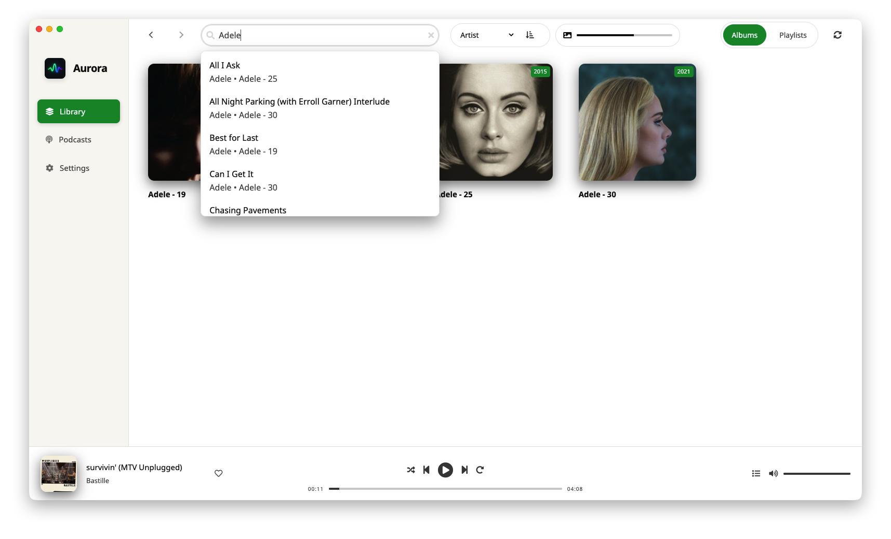
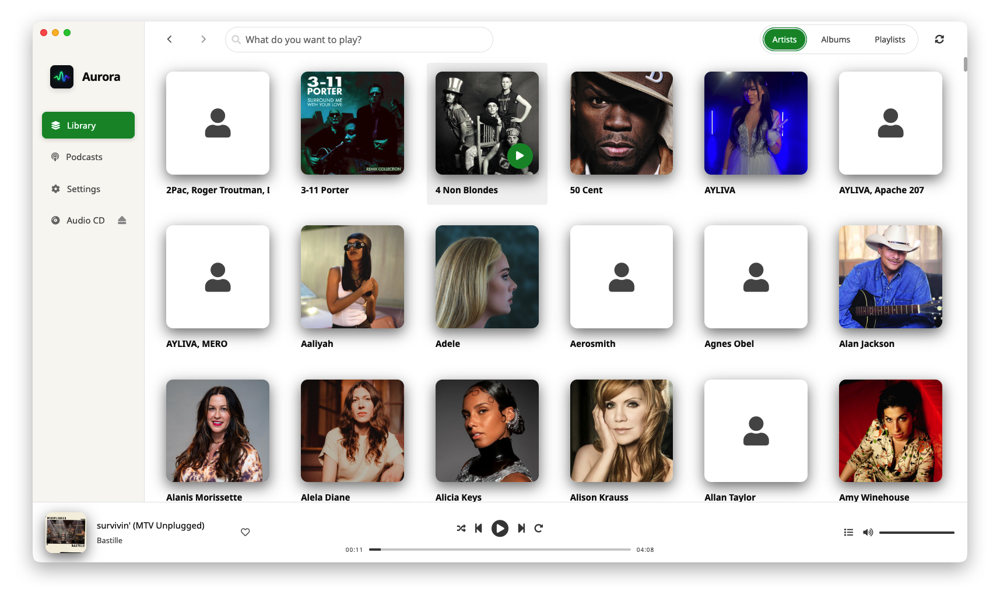

# Aurora

[](https://github.com/bbbneo333/aurora/releases)
[](https://github.com/bbbneo333/aurora/actions/workflows/checks.yml)

Aurora is a local-first desktop music player built for people who want full control over their library, playback flow, and data.
Version **1.3** expands Aurora into a broader media hub with podcasts, advanced sync workflows, and smarter library tooling while keeping the app fast and private.


---

## Why Aurora

- Local-first playback and library management
- No telemetry, no analytics, and no usage tracking
- Focused UI with practical power-user features
- Optimized for large FLAC libraries and daily listening workflows
- Fast iteration on highly requested community features

Aurora is designed to reduce friction: import quickly, organize clearly, sync reliably, and keep listening.

---

## What’s New in Version 1.3

- Dedicated **Podcasts** page with discovery and subscription flows
- Podcast refresh and local persistence pipeline
- DAP sync support for podcast episodes (`Podcasts` target folder)
- Enhanced album controls with repeat and multi-mode shuffle
- Improved settings UX, import flows, and smart cover generation



---

## Core Features

- Local music library scanning from user-selected folders
- Supported formats: `flac`, `mp3`, `m4a`, `wav`
- Album, artist, and playlist browsing with fast navigation
- Queue management and contextual playback controls
- Manual and smart playlists
- CD import with metadata-driven naming templates
- Podcast discovery, subscriptions, and episode sync
- DAP sync with progress, ETA, and resume support

---

## Functional Areas in Detail

### Library

The library is built around deterministic local indexing. You define source directories, Aurora scans and updates tracks, and the UI reflects changes quickly.
For compilation-heavy collections, grouping options and improved sync behavior help keep metadata tidy and browsing consistent.

**Benefits**
- Reliable local indexing for large collections
- Better handling of mixed-artist albums
- Fast updates after imports and metadata edits


### Podcasts

Aurora 1.3 introduces podcast support as a first-class area. You can discover shows, subscribe, refresh episodes from RSS feeds, and sync selected episodes to your target device.
Podcast content is managed with the same local-first mindset as music.

**Benefits**
- One app for music and podcasts
- Simple discovery and subscription flow
- Seamless sync to external listening devices


### CD Import

The CD import workflow focuses on fast FLAC archiving with clean folder and file naming.
You can configure output directory, naming template keywords, and Discogs credentials for richer metadata.

**Benefits**
- Cleaner digital archive from physical media
- Consistent naming standards across imports
- Less manual post-processing after ripping


### Album View vs Artist View

**Album View** is release-centric. It emphasizes a single album’s identity, tracks, genres, and album-level actions.
This is best when you want focused playback, edit album metadata, or work through an album as a complete work.

**Artist View** is catalog-centric. It emphasizes the artist as the entry point and groups related releases for exploration.
This is best for browsing an artist’s wider discography and moving between albums quickly.

**Practical difference**
- Use Album View for depth and per-release control
- Use Artist View for breadth and discovery across releases



---

## Privacy

Aurora is privacy-first:

- No telemetry
- No analytics
- No user behavior tracking
- Local database and local media ownership

Some metadata enrichment flows may perform explicit online lookups when that feature is used, but Aurora does not send analytics or profiling data.

---

## System Requirements

| Platform | Architecture | Status | Minimum OS |
|---------|---------------|--------|------------|
| macOS   | Apple Silicon (ARM64) | ✅ Available | macOS 12.0 (Monterey) |
| macOS   | Intel (x64) | ✅ Available | macOS 12.0 (Monterey) |
| Windows | x64 | ✅ Available | Windows 10 |
| Linux   | x64 | 🚧 Coming soon | Ubuntu 20.04+ (glibc 2.31+) |

---

## Development

### Prerequisites

- Node.js `^20.19.5`
- Yarn `^1.22.22`

### Run in development

```bash
git clone https://github.com/bbbneo333/aurora.git
cd aurora
yarn install
yarn start
```

### Package locally

```bash
yarn package
```

Build artifacts are generated in `release/`.

---

## Contributing and Feedback

- Report bugs and request features via GitHub Issues
- Include reproduction steps, expected behavior, and logs/screenshots when possible

👉 https://github.com/bbbneo333/aurora/issues

---

## Credits and License

- Original project by [bbbneo333](https://github.com/bbbneo333)
- Aurora is licensed under the [MIT License](./LICENSE)

Development of this fork is supported by AI-assisted workflows to accelerate implementation quality and deliver highly requested features from the original repository faster.
