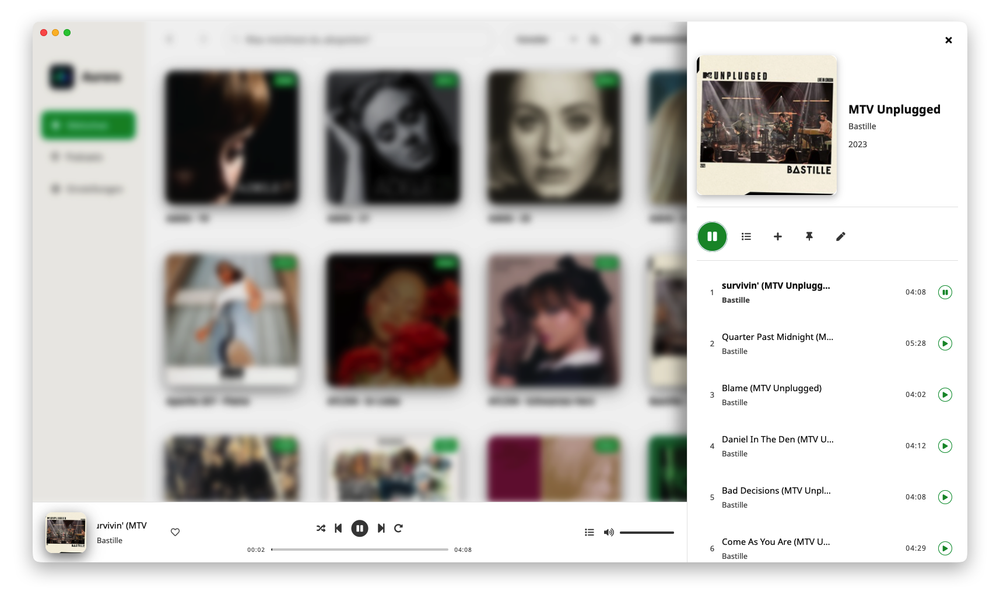
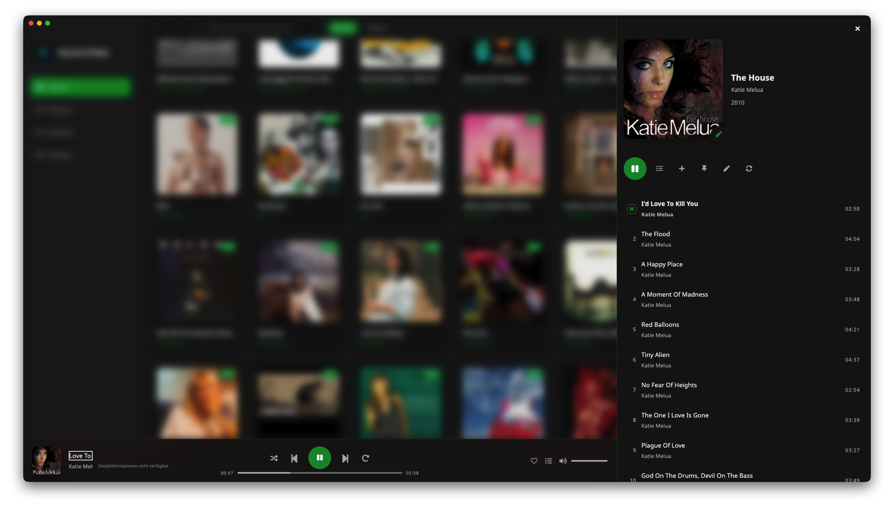
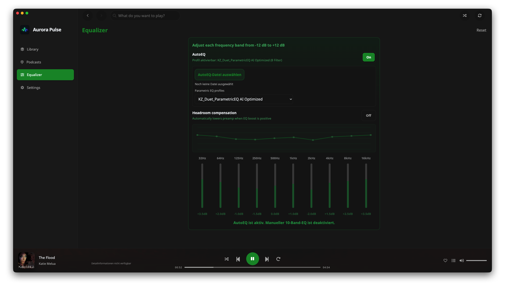
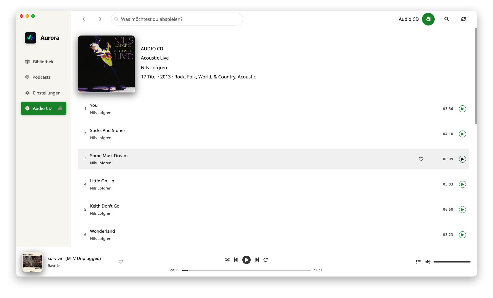
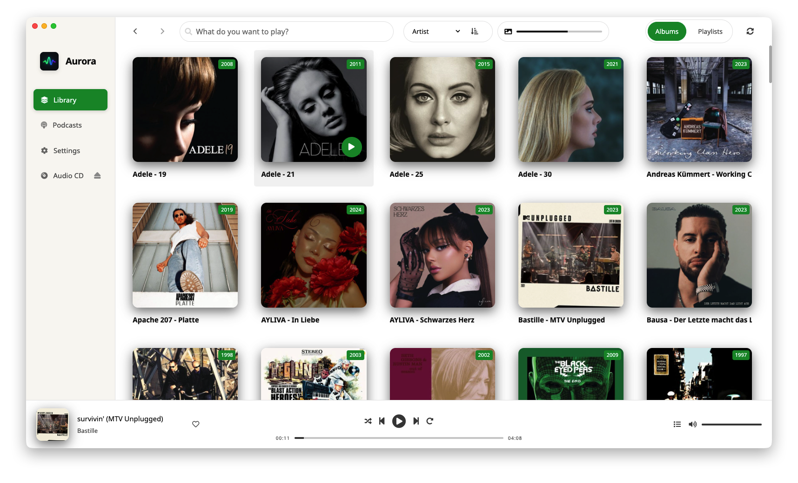
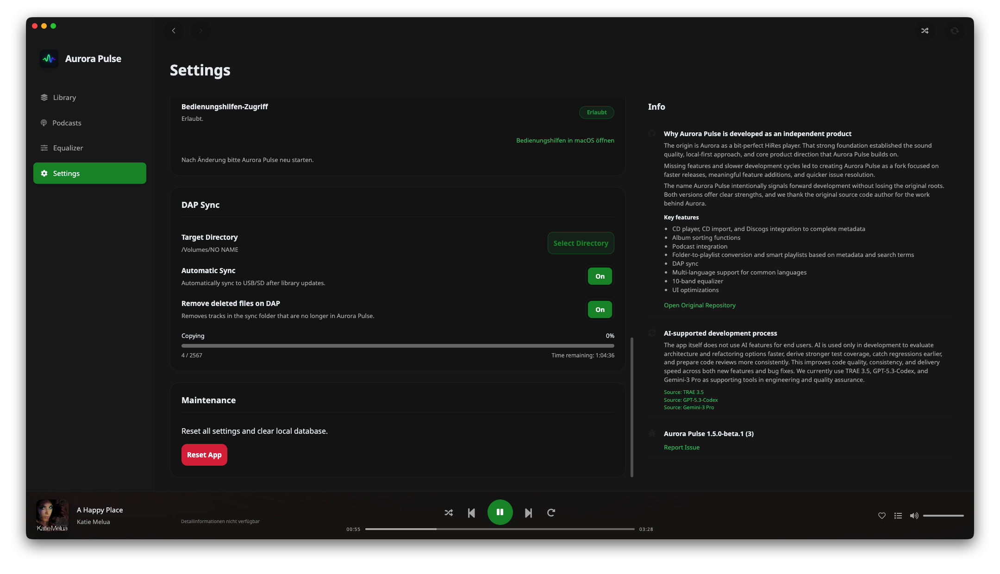
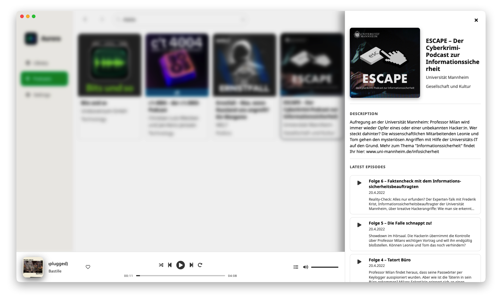

# Aurora Pulse

Aurora Pulse is a local-first desktop audio player for people who value sound quality, true library ownership, and frictionless daily listening. It is built to make serious audio use feel simple: precise control when you want it, fast flow when you need it.

---

## Built for Listening, Not for Lock-In

Aurora Pulse keeps playback local and private while exposing the details that matter to demanding listeners. File type, bitrate, bit depth, and sample rate are visible in the player, so quality is transparent instead of hidden. The equalizer workflow combines a 10-band setup, headroom compensation, and AutoEQ profile support to make tonal shaping accurate and repeatable. CD import is FLAC-focused, metadata-aware, and designed for clean archival outcomes.

---

## Core Experience

### High-Fidelity Playback

Playback is built around speed and clarity. Transport controls, queue actions, and contextual operations are all within immediate reach, so the app supports uninterrupted listening sessions instead of menu chasing. The player surface is optimized for confidence: you can act quickly and still see what is actually being played.

### Equalizer, AutoEQ, and Headroom Control

The EQ stack is designed for real-world tuning. Manual adjustments remain fast for broad shaping, while parametric AutoEQ profiles cover device-specific correction workflows. Headroom compensation helps maintain cleaner gain behavior when boosts are applied, reducing the need for workaround volume habits.

### CD Import with Metadata Management

CD import focuses on reliable FLAC archiving with practical metadata decisions at import time. Discogs-assisted matching enables better release confidence before files are committed to your library structure, which significantly lowers post-import cleanup.

### Library and Collection Flow

Aurora Pulse is optimized for large, long-lived collections. Source folders, scans, sorting, and collection views are designed to stay predictable as your library grows. Albums, artists, playlists, and search all follow a coherent interaction model, so navigation remains fast without visual inconsistency.

### Playlists and Device Workflow

Playlists support both straightforward curation and advanced smart collection behavior, with robust cover generation for mixed content. DAP sync extends that workflow to portable devices with explicit progress state, ETA visibility, resume support, and cancellation, making transfer sessions more reliable and less stressful.

### Podcasts in the Same Environment

Podcasts are integrated as a first-class listening area with discovery, subscriptions, episode refresh, and sideview details. Music and spoken content share one coherent playback environment, so switching context does not break your rhythm.

---

## Interface Philosophy

The UI is intentionally structured around continuity. Details open in a right sideview instead of forcing full-page context switches, topbar controls keep search and sorting near your current task, and action placement stays context-aware. The result is a cleaner mental model: fewer jumps, fewer surprises, and faster decisions during playback.

---

## Privacy and Ownership

Aurora Pulse is designed around ownership by default. Your media library, database, and listening history remain local to your machine. Optional metadata enrichment can perform explicit online lookups when you ask for it, but the app does not include telemetry, analytics profiling, or behavioral tracking.

---

## Project History and Why This Fork Exists

Aurora Pulse is a continuation fork of the original Aurora project by bbbneo333. The fork was created to maintain momentum on a focused direction: a modern local-first player with stronger execution for audiophile workflows and everyday reliability.

The motivation was practical. Users needed faster iteration on quality-of-life improvements, clearer audio transparency in the interface, more robust collection and sync behavior, and tighter consistency in how navigation and sideviews work across the app. Aurora Pulse keeps the original foundation and spirit, while intentionally accelerating delivery around these priorities.

This is not a cosmetic rename. It is an execution-focused evolution of the same core idea: local music ownership with high usability and high playback confidence.

---

## Original Source

Aurora Pulse builds on the original work by **bbbneo333**. The original repository is available at https://github.com/bbbneo333/aurora, and this project continues under the [MIT License](./LICENSE).
